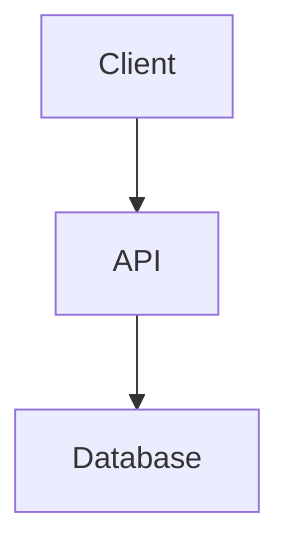
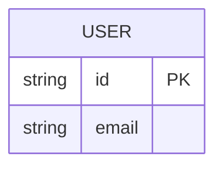

# {{PROJECT_NAME}}

> {{ONE_LINE_DESCRIPTION}}

## Vision

<!-- What does this project do and why does it exist? -->

## Users

<!-- Who uses this? What are their personas? -->

| Persona | Description | Key needs |
| ------- | ----------- | --------- |
|         |             |           |

## Features

<!-- Complete feature list with priority -->

| #   | Feature | Priority | Description |
| --- | ------- | -------- | ----------- |
|     |         |          |             |

## User Stories

<!-- Key user flows -->

### Story: {{STORY_NAME}}

**As a** {{persona}}, **I want to** {{action}}, **so that** {{benefit}}.

**Acceptance criteria:**

- [ ] ...

## Wireframes

<!-- ASCII wireframes for key screens -->

```
+----------------------------------+
|  Header / Navigation             |
+----------------------------------+
|                                  |
|  Main content area               |
|                                  |
+----------------------------------+
```

## Architecture



## Data Model



## Stack

- **Framework**:
- **Database**:
- **Auth**:
- **Hosting**:

## Constraints

<!-- Technical or business constraints that affect decisions -->

## Out of Scope

<!-- What this project explicitly does NOT do -->
